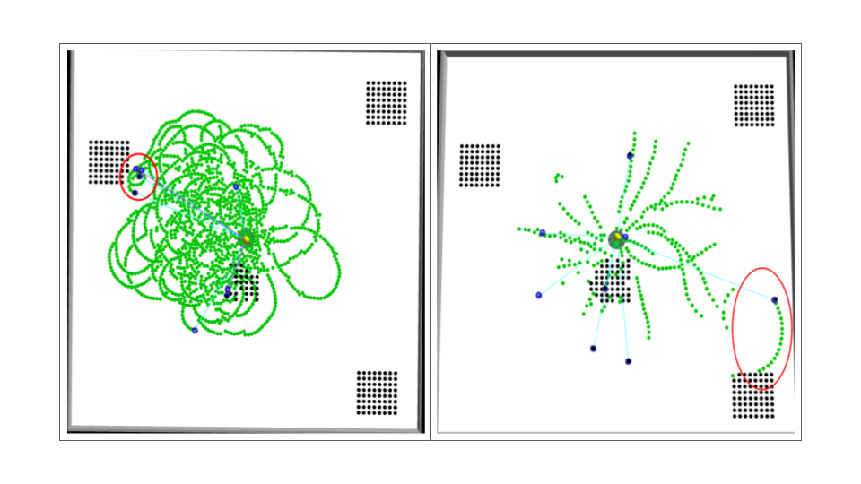

# What is NEAT
NeatFA is an application of Neuro Evolution of Augmented Topologies to the foraging problem in swarm robotics. This project includes a forked version of Vanilla Neat that evalutes an input neural network and returns the fitness and  evolves the neural network using JNeat which evalutes the population with multiple ARGoS simulations in parallel. This project is an optimized version of the original NEAT implementation.
## Problem Statement

As shown in the image above, previous experiments have shown some circular path traversal while returning the food (left). But this project indroduced a penalty-reward approach which minimizes the circular path travarsals while returning the food (right).
## Proposed Method
The proposed method is the optimized version of the NEAT algorithm, where the fitness function is modified to include a penalty for circular path traversal. Here, in every 5 seconds the bot is given a penalty along with the reward. In this way, the bot learns to return the food with minimal amount of path travarsal, which helped to reduce the cicular travarsals as shown above.
## Results
%20with%204%20Different%20Cost%20Factors%20in%20Cluster%20Distributions,%20Trained%20in%20100%20Epochs.png)
This result shows the comparison between 3 swarm sizes (4, 8 and 16) with 4 different cost.

.png)
This result shows the rewards collected using different cost efficiencies in every 5 seconds.